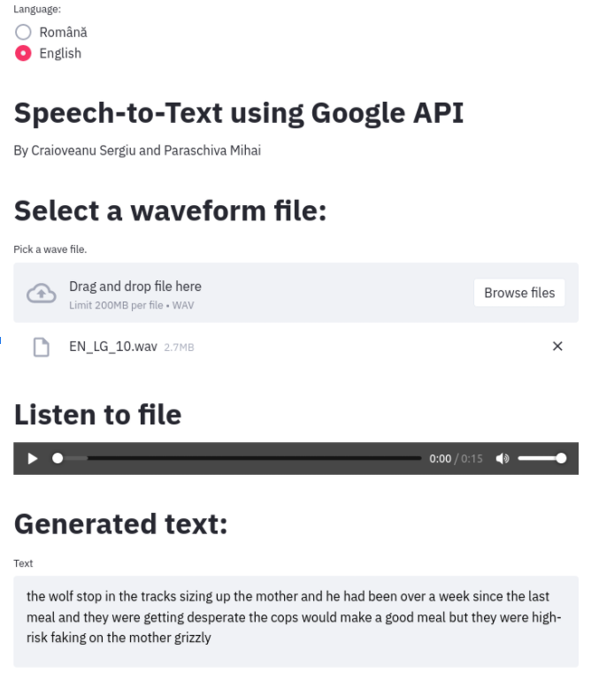

# Streamlit App integrating Google Speech-To-Text API in Python

## Authors:
[Sergiu Craioveanu](https://github.com/the-sergiu)
[Paraschiva Mihai](https://github.com/ParaschivaMihai)
## Description
Intuitive Streamlit App written in Python which converts a wavefile into text by leveraging Google Speech-to-Text API capabilities. Requires a credentials JSON file obtained using the steps described [here](https://www.hellocodeclub.com/python-speech-recognition-create-program-with-google-api/).

Languages available: English, Romanian.

## Setup
1. Clone Repo (duh)
2. Use a Google Account to obtain the credentials JSON, as per the link above.
3. (Optional) Create a credentials folder within the repo.

To connect to the Google Speech-To-Text API, we require an OS environment variable which specifies the path for the configured credentials (a .JSON file).

**Linux**:
```
export GOOGLE_APPLICATION_CREDENTIALS="/home/serj/Desktop/Google-Speech-To-Text-API-Python-App/credentials/key-file.json"
```

4. Run the following command to install requirements:
```
pip install -r requirements.txt
```
We used Python 3.7 for this project.

## Running the app

To run the app, navigate to the **src/** folder within the repo, and simply run:

```
streamlit run interface.py
```

## App Display

This is how the app looks after uploading one of our samples.




## Misc

We also included our own samples within the **sound_samples** directory, both in Romanian and English.

